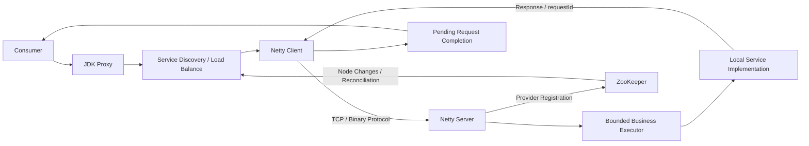

# KRPC

基于 Java 与 Netty 的轻量级 RPC 框架，实现从接口调用、服务发现到网络传输、服务端调度和响应关联的完整调用链路。

项目由五个 Maven 模块组成，保留 Socket 传输实现作为对照，主要实现采用 Netty 长连接。提供协议测试、并发集成测试和独立 JMeter 采样器，支持验证请求正确性、异常清理与不同负载下的运行表现。

## 核心能力

| 模块 | 实现 |
| --- | --- |
| 远程调用 | JDK 动态代理构造请求，服务端查找本地实现并反射调用 |
| 网络传输 | Netty NIO；按 Provider 地址缓存 Channel；同一连接支持多个在途请求 |
| 请求管理 | 使用 requestId 关联响应；处理超时、写失败、连接断开及迟到响应 |
| 通信协议 | 自定义二进制帧；半包缓存、粘包拆分、协议字段校验和报文大小限制 |
| 服务发现 | ZooKeeper 临时节点注册；CuratorCache 感知节点变更；重连后重新同步服务列表 |
| 流量分配 | 随机、轮询、一致性哈希和 LRU 负载均衡 |
| 执行调度 | 有界业务线程池隔离网络 I/O；队列饱和时返回 503 |
| 故障处理 | 调用熔断、可重试服务白名单、连续失败节点隔离和 TCP 恢复探测 |
| 资源管理 | Channel 写缓冲高低水位、客户端不可写快速失败、服务端关闭与服务注销 |
| 可观测性 | TraceId / SpanId 传递、调用日志和 Zipkin 上报 |

## 调用链路



网络收发由 Channel 所属的 EventLoop 执行，业务方法交给服务端共享线程池。多个调用线程可以复用同一 Channel，响应允许乱序到达，由 requestId 匹配各自的等待结果。当前代理接口对调用方仍然是同步返回，传输层的异步关联不等同于异步业务 API。

## 项目结构

| 模块 | 职责 |
| --- | --- |
| `krpc-api` | 示例服务接口和共享数据类型 |
| `krpc-common` | 请求响应模型、协议编解码、序列化和配置工具 |
| `krpc-core` | 代理、传输、注册发现、调度、负载均衡和容错 |
| `krpc-provider` | 示例服务端、传输集成测试和故障演练 |
| `krpc-consumer` | 示例客户端和长连接对照基准 |
| `tools/jmeter` | 独立 Java Request 采样器、Echo Provider 和压测脚本 |

## 构建与运行

### 环境

- 建议使用 JDK 17 和 Maven 3.9；项目编译目标为 Java 8。
- 运行服务注册发现示例需要可连接的 ZooKeeper，默认地址为 `127.0.0.1:2181`。
- Zipkin 为可选依赖，上报地址为 `http://localhost:9411/api/v2/spans`；未启动时可关闭 tracing。
- JMeter 压测工具基于 JMeter 5.6.3，与主工程独立构建。

在仓库根目录执行：

```sh
mvn clean install
```

### 注册发现示例

在 IDE 中按 Maven 多模块工程导入，在 Provider 和 Consumer 各自的 `application.properties` 中使用一致的配置：

```properties
rpc.name=krpc
rpc.version=1.0.0
rpc.serializer=hessian
rpc.registryAddress=127.0.0.1:2181
rpc.loadBalance=consistencyHash
rpc.tracingEnabled=false
rpc.businessThreads=16
rpc.businessQueueCapacity=1024
```

1. 启动 ZooKeeper。
2. 运行 Provider 模块的 `org.example.provider.ProviderTest`，示例监听端口为 9999。
3. 运行 Consumer 模块的 `org.example.ConsumerTest`，通过代理调用示例 UserService。

Provider 示例中的监听地址为固定值，修改端口时需要同时修改服务注册地址与监听端口，不能只调整配置中的 `rpc.port`。需要多个 Provider 时，各实例应使用不同端口。

### 关键参数

| 参数或策略 | 默认值 | 说明 |
| --- | --- | --- |
| `rpc.registrySessionTimeoutMillis` | 40000 ms | ZooKeeper 会话超时 |
| `rpc.businessThreads` | CPU 核数 × 2，限制在 4～16 | 每个服务端实例的共享业务线程数 |
| `rpc.businessQueueCapacity` | 1024 | 业务等待队列容量 |
| `rpc.nodeFailureThreshold` | 3 | 达到连续失败阈值后在当前客户端隔离节点 |
| `rpc.nodeProbeIntervalSeconds` | 10 s | 被隔离节点的 TCP 探测周期 |
| `rpc.nodeProbeTimeoutMillis` | 800 ms | 单次 TCP 建连探测超时 |
| 请求超时 | 5000 ms | 当前 Netty 客户端代码中的固定值 |
| 建连超时 | 3000 ms | 当前 Netty 客户端代码中的固定值 |
| 写缓冲水位 | 64 / 128 KiB | 低 / 高水位；是可写性阈值，不是内存硬上限 |

## 通信协议

```text
magic(2) | version(1) | traceLength(4) | trace(variable)
         | messageType(2) | serializerType(2) | bodyLength(4) | body(variable)
```

括号内为字节数。魔数为 `0xCAFE`，当前协议版本为 `1`；Trace 区域使用 UTF-8 编码，包含 TraceId 和 SpanId。

- **半包**：完整头部或消息体尚未到齐时恢复读取位置，等待后续数据。
- **粘包**：解码器从累积字节中按长度读取一帧，Netty 继续解码剩余完整帧。
- **非法帧**：校验魔数、版本、消息类型、序列化类型及长度字段，拒绝不符合协议的输入。
- **大小限制**：Trace 区域最大 4 KiB，消息体最大 8 MiB；编码和解码均检查边界。

支持 JDK 对象序列化、JSON、Hessian 和 Protostuff。当前名为 `ProtobufSerializer` 的实现使用 Protostuff RuntimeSchema，不依赖 `.proto` 文件，也不提供原生 Protobuf IDL 兼容性。

## 注册发现与故障恢复

服务注册采用以下 ZooKeeper 路径结构：

```text
/MyRpc
  /<service-interface>
    /<host>:<port>                    # Provider 临时节点
  /CanRetry
    /<service-interface>
      /<host>:<port>                  # 可重试 Provider 标记
```

Curator 是操作 ZooKeeper 的客户端库，不是额外部署的注册中心服务。节点事件更新客户端缓存和负载均衡节点集合；客户端与 ZooKeeper 断线后重连时，重新拉取服务列表与重试标记进行对账，不要求重启客户端进程。

注册节点仍存在但 RPC 调用持续失败时，客户端将该地址从自己的候选集合中隔离，不删除注册中心中的节点。定时 TCP 探测成功且节点仍在服务列表中时，将其恢复为候选节点。TCP 可连接只代表网络层恢复，不保证业务方法健康。

## 测试

```sh
mvn verify
```

测试覆盖协议拆包与边界校验、序列化往返、请求响应关联与清理、有界队列拒绝、节点失败计数以及真实 TCP 长连接并发调用。

ZooKeeper 故障演练需要本机 `127.0.0.1:2181` 可用；未启动时该测试会跳过。故障演练会注册示例服务，应在专用测试环境运行，不要连接生产注册中心。

### JMeter 压测

自定义 RPC 不是 HTTP，使用项目提供的 **Java Request 采样器**，而不是 HTTP Request。下面的 PowerShell 命令均从仓库根目录执行，将 JMeterHome 替换为实际安装目录。

先构建并安装采样器：

```powershell
powershell -NoProfile -ExecutionPolicy Bypass -File tools/jmeter/Build-Plugin.ps1 -JMeterHome C:/tools/apache-jmeter-5.6.3
```

在一个终端启动 Echo Provider，保持该进程运行：

```powershell
powershell -NoProfile -ExecutionPolicy Bypass -File tools/jmeter/Start-Provider.ps1 -JMeterHome C:/tools/apache-jmeter-5.6.3
```

在另一个终端先运行小规模正确性检查：

```powershell
powershell -NoProfile -ExecutionPolicy Bypass -File tools/jmeter/Run-Load.ps1 -JMeterHome C:/tools/apache-jmeter-5.6.3 -Threads 10 -RampSeconds 1 -Loops 20 -WarmupLoops 10
```

确认错误率为 0 后，再逐步增加并发或持续时间：

```powershell
# 100 个调用线程，预热后持续压测 5 分钟
powershell -NoProfile -ExecutionPolicy Bypass -File tools/jmeter/Run-Load.ps1 -JMeterHome C:/tools/apache-jmeter-5.6.3 -Threads 100 -DurationSeconds 300 -WarmupLoops 10000

# 100 个线程，每线程 10000 次，合计 100 万次测量调用
powershell -NoProfile -ExecutionPolicy Bypass -File tools/jmeter/Run-Load.ps1 -JMeterHome C:/tools/apache-jmeter-5.6.3 -Threads 100 -Loops 10000 -WarmupLoops 10000
```

需要使用 GUI 时，安装插件后重启 JMeter，再打开工具目录中的 `rpc-load.jmx`。先以少量线程检查 Java Request 的参数和结果，正式压测使用非 GUI 模式。

每次运行生成独立的参数记录、JTL 和 HTML 报告。报告不计入预热样本；原始 JTL 保留预热和测量样本，可按标签区分。采样器校验每次返回内容，失败响应及内容不匹配均计为失败，不能只根据 JMeter 进程退出码判断是否成功。

**压测范围与口径：**

- Echo 基线经过实际 Netty 传输、编解码、业务调度及响应关联，关闭注册中心、重试、限流和 tracing；不代表完整服务治理链路的性能。
- 默认使用 Hessian、1024 字节 ASCII 内容；该长度不是序列化后完整网络帧的大小。
- 100 万次是累计调用次数，不是 100 万并发；失败尝试也计入调用次数。
- 每个调用线程等待响应后再发下一次，属于闭环负载；该模型会低估过载时的排队延迟，不能据此推断无限流量下的容量。
- 比较 QPS、错误率、P95/P99 时，同时记录报文、线程数、预热、机器配置和 CPU / GC 情况，并重复运行。较大规模测试建议把客户端与 Provider 放在不同机器上。
- 调整序列化方式后重启 Provider 和 JMeter JVM，避免复用已初始化的序列化器。当前 JSON 实现对标量返回值存在兼容性限制，Echo 基线建议使用 Hessian。

## 使用范围

当前项目面向 Java 服务通信与 RPC 工程实践，不是 Dubbo、gRPC 或 Thrift 的生产替代品。协议版本校验不代表跨版本兼容性保证；重试白名单不提供业务幂等或 exactly-once 语义。

用于生产环境前，需要完善依赖安全升级、TLS / 鉴权、序列化类型约束、长时间空闲下的心跳链路验证、错误语义和跨版本兼容测试，并在实际部署环境中验证故障恢复与容量边界。
